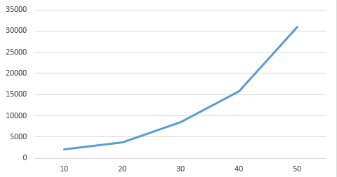
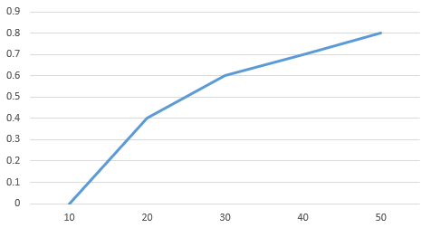
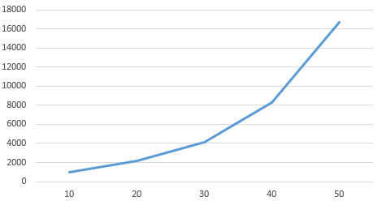

# ProcessScheduler (SJF)

This is simple C# implementation of process scheduler that uses SJF algorithm.
This algorithm serves to solve convoy effect by executing processes with lowest estimated execution time.

Structure of `Process` class:
- `Id` - guid of the process
- `ExecutionTime` - estimated execution time
- `WaitingTime` - total time that process waited before execution

Structure of `ProcessScheduler` class:
- `Processes()` - SortedSet of processes
- `Add(Process)` - add process to the queue
- `Add(List<Process>)` - add list of processes to the queue.
- `CalculateWaitingTime()` - recalculate waiting time for all processes in the queue.
- `Execute()` - start execution of processes in the queue.

## Graphs

Graph of the dependence of the average waiting time on the intensity of the incoming flow of applications:

A graph of the dependence of the percentage of idle time on the intensity of the incoming flow of applications:

The graph of the dependence of the number of applications on the waiting time for a fixed intensity of the incoming flow of applications:

